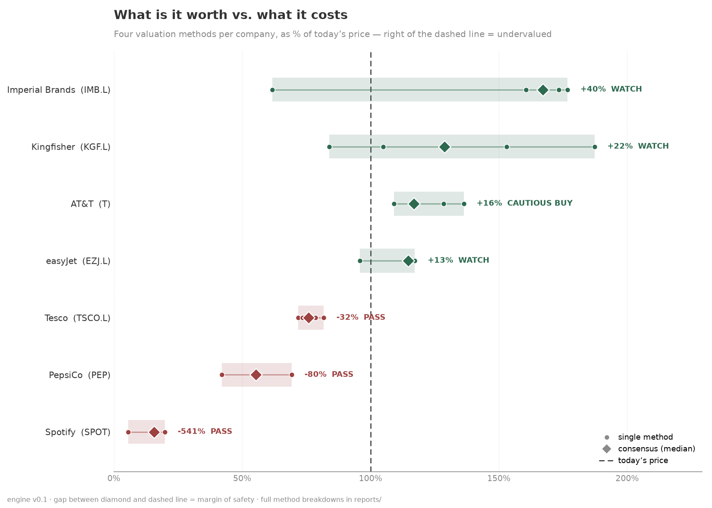

# Valuation Engine

A semi-automatic value-investing screener: four independent valuation methods, a tiered verdict ladder with an asymmetry test, and hard-coded conservatism (bear-case DCF only, growth capped at 2%, margin-of-safety hurdles). Built to answer one question rigorously: what is this company worth, and how big is the gap to today's price?*



*Each bar spans the four methods' fair-value estimates (as % of today's price); the diamond is the consensus, the dashed line is today's price. The horizontal gap between diamond and line *is* the margin of safety.*

## Design principles

- **Semi-automated.** The tool computes the figures; three judgement inputs per company stay human (moat rating, cyclicality flag, written thesis). No thesis → no verdict.
- **Four-pronged methodology.** Fair value = median of four independent methods (EPV, bear-case DCF, Graham Number, normalised multiples). If the methods disagree by more than 2.5×, the verdict is capped at WATCH.
- **The bear case binds.** Only the pessimistic DCF enters the consensus. Bull/base scenarios exist to measure estimate uncertainty and to power the asymmetry test.
- **Tiered verdicts** (owner-designed): STRONG BUY / BUY / CAUTIOUS BUY / WATCH / PASS. A CAUTIOUS BUY (margin of safety 15–30%) additionally requires bull-case upside ≥ 3× bear-case downside, and is capped at half position size.
- **Cash is a position.** The engine happily concludes that nothing is cheap enough.

Full specification: [`docs/ENGINE_DESIGN.md`](docs/ENGINE_DESIGN.md) · pipeline: [`docs/SYSTEM.md`](docs/SYSTEM.md) · value-trap filters: [`docs/VALUE_TRAP_CHECKS.md`](docs/VALUE_TRAP_CHECKS.md)

## Quickstart

```bash
pip install -r requirements.txt
python engine_v01.py        # verdict table + ASCII valuation ranges (live data)
python report_card.py       # one-page report card per company -> reports/*.md
python report_card.py IMB.L # deep-dive card for a single ticker
python football_field.py    # renders valuation_chart.png
```

Edit the `WATCHLIST` dict at the top of `engine_v01.py` to add companies and your own moat/cyclicality/thesis inputs. Verdicts are deliberately capped at WATCH until a written thesis exists — the tool refuses to be more confident than its owner.

## Limitations (v0.1) 

v0.1 is deliberately harsh: it prices steady cash flows and refuses to pay for growth. That conservatism is the point — but it leaves the engine ignorant in known, documented ways. Full backlog in `docs/VERSION_PLAN.md`; headline items:

**v0.2 — measurement, risk, and the growth lens (issues #1–#8)**
- **Growth lens / reverse DCF column** (#2, headline feature): every name gets an *implied growth* figure - the FCF growth rate today's price assumes — printed beside the margin of safety in the verdict table and report cards. v0.1 is blind to growth-priced names (it just prints a huge negative margin); v0.2 makes the engine say *"this price assumes 24%/yr for a decade — do you believe that?"* Already proven manually in the SPOT (~24%), PEP (~10%), KGF (−7.8%) and IMB (−8.4%) theses; v0.2 automates it.
- **IFRS 16 lease adjustment** (#8): headline FCF for leased-estate retailers omits lease principal repayments (rent sits in financing). Found by benchmarking capex/D&A across peers — US owner-operators ~1.0, UK leaseholders 0.3–0.6. Kingfisher's ~£1.0bn FCF is nearer £650–750m adjusted; Tesco's overstated similarly. Until fixed, the engine systematically flatters UK leased retail vs US GAAP names.
- **Maintenance vs growth capex** (#1): FCF deducts *all* capex, double-penalising firms investing in growth. Fix: owner earnings = OCF − min(capex, D&A), 4-yr medians.
- **Structural-decliner mode** (#3): melting names (IMB) need break-even decline grids, not a bear DCF with a growth floor.
- **Risk panel + weighting engine** (#5): replace cliff-edge thresholds with per-metric subscores (distance from danger, drillable to components — no opaque composite); absolute kill-gates preserved underneath. Position sizing driven by the panel rather than flat 8%/4% caps.
- **Multiples upgrade** (#6): own-history and sector medians instead of a flat 15×.
- **Wrong-model flags** (#4): banks/insurers and pre-profit names get an explicit "wrong tool" refusal instead of quietly unreliable output.
- **Journal stubs** (#7): dated thesis and review entries per position.

**v0.3 — growth mode (expectations investing)**
The current engine correctly identifies that growth-priced names (SPOT −5x margin) don't fit a value framework but "refuses to value" is not the same as "values". v0.3 inverts the question: compute the FCF growth today's price *implies*, then test it against driver-ceiling "lever maths" (subscribers × price × margin, each capped at generous ceilings set *before* seeing the verdict). BUY only when the price implies less growth than conservative levers deliver. Prototyped by hand in the Spotify thesis (~24%/yr implied vs ~3.6x achievable); v0.3 automates it.

## Development notes

The investment framework (method selection, verdict tiers, the asymmetry test, all thresholds and conservatism rules)is my design (see `docs/ENGINE_DESIGN.md` for the signed-off parameters). Implementation is AI-pair-programmed: I specify and audit; drafted code is reviewed line-by-line before inclusion. Known flaws found in auditing (e.g. the maintenance-vs-growth capex distortion below) are logged rather than hidden.

## Honest notes

Ratio screens and conservative DCFs identify statistically cheap stocks; some are bargains, some are cheap for good reason. This tool narrows the field and enforces discipline. The final judgement is deliberately not automated. Nothing here is financial advice.
